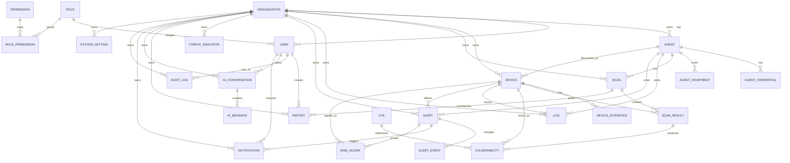

# ER Diagram

This diagram shows the MVP database relationship model required by the corrected SRS and architecture documents. It is intentionally scoped to the local-first pipeline: Agent registration and heartbeats, device discovery, vulnerability scanning, logs, threat detection, alerts, risk scoring, local AI explanations, reports, audit, and notification data.

## Notes

- Organizations are explicit even for a single-organization MVP so future multi-organization isolation is not retrofitted later.
- Agent credentials are stored in a separate table from user accounts. This matches the Agent security model from the SRS and architecture docs.
- Risk scoring is intentionally represented as both a final score and a score-factor payload instead of a black-box integer only.
- AI conversations and messages are provider-agnostic; they do not assume a specific external LLM or cloud AI service.
